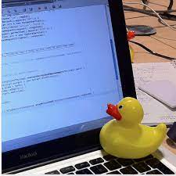

## 0707 (오전) 

### 오전 학습 목표 : 로컬저장소, 원격저장소에 대한 이해와 Git 사용법 복습_김탁기T


```bash
$ git log --oneline
```

> commit 을 몇 개 한지, 간단하게 확인 가능


```bash
$ git checkout `해시값`
```

> 서버 관리 롤백 가능. commit을 했다면 과거 시점으로 돌아가 복구 가능함
>
> `& git log` 로 확인 후 원하는 시점 선택


**📌 주의 : 원격 저장소에서 자체적인 수정 금지!!!**

​	**해결 방법? : 원격 저장소에 있는 파일을 수정하고 싶으면, <u>로컬 저장소에서 파일 수정 -> commit -> (원격저장소로) push</u>**





​							**🐤 러버덕 디버깅, 당신의 코딩 실력을 향상시켜 줄 러버덕 한 마리 분양 어떠신가요..?**

 

**⭐️ Code 클론 시 압축(ZIP)과 https copy의 차이?**

: 압축(ZIP)은 최신 버전의 파일/폴더만 가지고 오는 것, https copy는 git 저장소를 가지고 오는 것

```bash
$ git clone '복사한 git https 주소' 

# 주소 예시 : https://github.com/grape45/TIL.git
```

> https copy로 클론 하는 것이 분산버전관리를 활용하는 방법이다.
>
> 압축(ZIP)은 단지 파일만 내려 받고 싶은 경우임.


**📌 클론 이후 추가 변동 사항이 생겼다면?**

```bash
$ git pull origin master
```

> 이 코드로 원격저장소에서 로컬저장소로 받아오자 !
>
> 당연하지만, commit 후 push는 불가능하다.


#### ✍🏻 **한 줄 요약**

```
Clone은 저장소를 받아오는 것, Pull은 Commit을 받아오는 것
```


## 0707 (오후) 

### 오후 학습 목표 : 작업/협업 필수인 branch에 대한 이해와 활용법

- Git을 CLI(Command Line Interface)에서 활용하기 위해서는 아래의 명령이 필수적이다.

#### **✔️⭐️ 항상 모든 명령어 뒤에 상태를 확인하자 ! **

```bash
$ git status # 상태 체크는 습관적으로 !
```


#### **📌 Branch basic commands**

```bash
(master) $ git branch {brand name} # 브랜치 생성, {brand name} 미 입력 시 브랜치 조회
(master) $ git checkout {branch name} # 브랜치 이동, git checkout master
(master) $ git checkout -b {branch name} # 브랜치 생성과 동시에 이동
(master) $ git branch # 브랜치 목록
(master) $ git branch -d {branch name} # 브랜치 삭제
(master) $ git merge {branch name} # 브랜치 병합, master에서 병합
# master에 merge commit이 되면 branch를 삭제해도 됨
```


#### **⭐️ branch(가지치기) 하기 이전 단단한 뿌리가 필요하다. 반드시 root-commit 발생시키기 !**

> root-commit ? : 최초의 commit이라고 생각하자
>
>  `$ git init -> $ touch README.md -> $ git add . -> $ git commit -m 'root_commit_complete!' `


**Q. HEAD는 뭔가요?**

```bash
$ git log --oneline
d7afaf1 (HEAD -> master) add README.md 
```

> 내가 이동한 Commit의 정보를 표시. 위 예시는 master에 위치해 있음을 나타냄


```bash
$ git log --oneline --graph # log 기록을 보며 graph도 시각적으로 나타남
```


* `$ git stauts` 로 충동 파일 확인 

```bash
<<<<<<<< HEAD
# 마스터에서 작업함...
=======
# 테스트에서 작성
>>>>>>> feature/test

# conflicts 발생 후 unmerged 시 `Merging` 메세지가 나타남

DESKTOP USER ~/Desktop/folder (master|`MERGING`)
```


#### ✔️ 협업 단계의 git/Github


#### 📌 Github Flow 기본 원칙

```
1. master branch는 반드시 배포 가능한 상태여야 한다.
2. feature branch는 각 기능의 의도를 알 수 있도록 작성한다.
3. Commit message는 매우 중요하며, 명확하게 작성한다 ⭐️
4. Pull Request를 통해 협업을 진행한다
5. 변경사항을 반영하고 싶다면, master branch에 병합한다.
```


#### 📌 Feature Branch Workflow 와 Forking Workflow

1. **Feature Branch Workflow : Shared repository model**

> 저장소의 소유권이 ***있는*** 경우


#### **Pull Request에 대한 이해**

```bash
$ git push origin {branch name} #Github에서 Pull Request를 받아야 함
```

> github에서 Pull requests -> New pull request 또는 Create pull request 로 접근
>
> 즉, pull request 는 **master branch에 병합을 요청**하는 것


2. **Forking Workflow : Fork & Pull Request model**

> 저장소의 소유권이 ***없는*** 경우


#### **fork에 대한 이해와 Pull Request 과정**

```bash
$ git clone '복사한 git https 주소' 

# 주소 예시 : https://github.com/grape45/TIL.git
```

> **<u>	How to Pull Request?</u>**
>
> ​		**1. Github에서 Fork** : Fork할 저장소에서 Fork -> 자신의 원격 저장소에 저장될 이름 작성 후 Check fork -> 											**자신의 로컬 저장소** URL clone ->  `$ git clone {복사한 URL}` ->											`$ git branch {branch 이름} ` -> `$ git checkout {branch 이름}`
>
> ​		**2. root-commit** :  `$ git add .` -> `$ git commit` 
>
> ​		**3. Pull Request** : `$ git push origin {branch 이름}`-> `$ git remote -v` 
>
> ​				📌 `$ git remote -v`  : 저장소 소유권자가 아닌 나(저장소 비 소유권자)의 원격저장소 정보로 기록됨
>
> ​		**4. Github에서 Pull Request** : Creat pull request -> 저장소 소유권자의 승인 대기
>
> ​				⭐️ **head repository와 base repository 반드시 확인 !!!** 
>
> ​				⭐️ **head -> base 방향으로 merge 됨 !!!**


**Q. Merge Request가 아니라 왜 Pull Request라고 하나요?**

​		**A. 관점의 차이. GitLab 에서는 Merge Request 라는 용어를 사용함**


#### ✍🏻 **수업 내용 요약 **

```bash
1. 모든 변경사항은 로컬에서 하고 commit 후 push

2. .git ignore : 목록에 적으면 git이 무시함 # git으로 추적하지 않는 파일 관리 # 이름 바꾸기 불가능
 
3. .git keep : 빈 폴더를 만들기 위함 # git에선 빈 폴더는 의미 없음, 효율적으로 관리하기 위함 # 이름 바꾸기 가능
```


#### **🎯 수업 이후 오늘의 과제**

Forking Workflow 총 과정 다시 실습 및 확인

