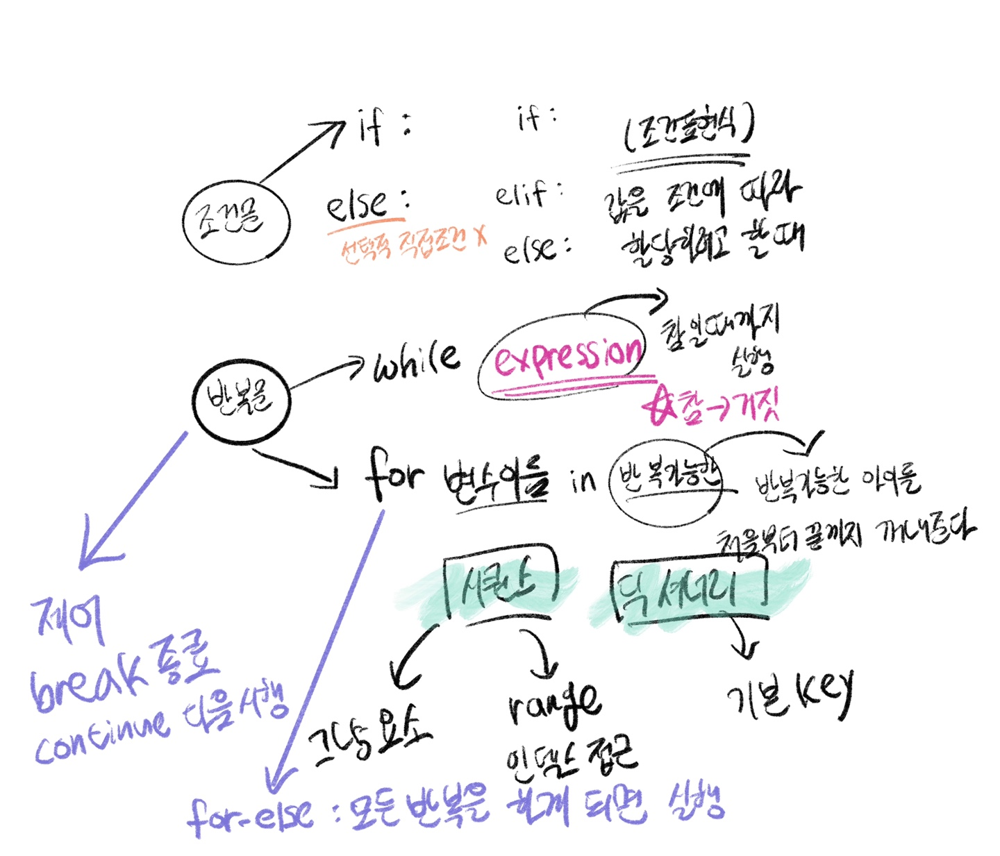

## 0712 수업

### 🎯 오전 학습 목표 : Python 기초_youtube_live


#### 조건문과 반복문

##### ✔️ 제어문(Control Statement) : 기본적으로 위에서부터 아래로 순차적 명령 수행, 순서도(flow chart)로도 표현 가능


##### ✔️ 조건문(Conditional Statement)

1. 조건문은 참/거짓을 판단할 수 있는 조건식과 함께 사용
2. expression에는 참/거짓에 대한 조건식

```python
if < expression >:
    # Run this Code Block # space bar 4칸 띄우기
else:
    # Run this Code block 
    
# 예시

# 1. num은 input으로 사용자에게 입력을 받으세요
print("숫자를 입력하세요 : ")
num = int(input())
# print(num)
# 2. 조건문을 통해서 홀수/짝수 여부를 출력하세요.
# 숫자로서의 num이 필요함
if num % 2 == 1:
    print("odd")
else:
    print("even")


# 다른 방법
# num = input()
# if int(num) % 2 == 1 and int(num) > 100:
# print('odd')
# else:
# print('even')

# 이 경우엔 둘 다 int 이므로, 위 방법이 더 편함
```


##### ✔️ 복수 조건문 : if, elif, else

```python
# 내가 작성한 코드
print('오늘의 대기질 수치를 입력하세요 : ')
num = int(input())

if num < 0:
    print("0 이상의 대기질 수치를 입력하세요")
elif num >= 0 and num <= 30:
    print("대기질 '좋음'")
elif num > 30 and num <= 80:
    print("대기질 '보통'")
elif num > 80 and num <= 150: # `<=` 조건은 붙여 줄 필요 없음
    print("대기질 '나쁨'")
elif num > 150:
    print("대기질 '매우나쁨'")
else:
    print("수치를 잘못 입력했습니다.")
    

# 선생님께서 작성한 코드
dust = int(input())

if dust > 150:
    if dust > 300:
        print('실외활동을 자제하세요.')
    print('매우 나쁨')
elif dust > 80:
    print('나쁨')
elif dust > 30:
    print('보통')
elif dust > 0:
    print('좋음')
else:
    print('음수 값입니다.')
```

 

##### ✔️ 조건 표현식(Conditional Expression) : 조건 표현식을 일반적으로 조건에 따라 값을 정할 때 활용 = 삼항 연산자(Ternary Operator)

```python
# 예시
num = -10

## 조건문 코드
# 1. 양수면 그대로
if num >= 0:
  value = num
# 2. 음수면 - 붙여서
else:
  value = -num
print(num, value)

## 조건 표현식 코드
value = num if num >= 0 else -num
#     참일 경우 <expression> 거짓일 경우
```


##### ✔️ 반복문

1. while 문 : 종료조건에 해당하는 코드를 통해 반복문을 종료시켜야 함

- 조건이 참인 경우 들여쓰기 되어 있는 코드 블록이 실행됨

- 코드 블록이 모두 실행되고, 다시 조건식을 검사하며 반복적으로 실행됨

- **무한 루프** 하지 않도록 종료조건이 반드시 필요

  ```python
  # while <expression>: # expression은 참
    
  # 예시
  
  # 처음 시작 값
  from tkinter import N
  
  
  n = 0
  # 0부터 더하기 위해서
  result = 0
  # user_input 값
  user_input = int(input())
  
  n = 0
  result = 0
  
  while n <= user_input: 
      print(f'n: {n}, result: {result}')
      result += n 
      n += 1
  print(result)
  
  print('=============')
  print('위 코드와 차이 비교하기')
  while n < user_input:
      print(f'n: {n}, result: {result}')
      n += 1
      result += n
  print(result)
  ```


2. for 문

- 시퀀스(string, tuple, list, range)를 포함한 순회가능한 객체(iterable) 요소를 모두 순회함

  - 처음부터 끝까지 모두 순회하므로 별도의 종료조건이 필요하지 않음

  ```python
  for <변수명> in <iterable>:
    # Code block
    
  # 예시 1
  for fruit in ['apple', 'mango', 'banana']
  	print(fruit)
  print('끝')
  # apple
  # mango
  # banana
  # 끝
  
  # 예시 2 : 사용자가 입력한 문자를 한 글자 씩 세로로 출력하시오
  chars = input()
  # hi
  
  for char in chars:
    print(char)
  # h
  # i
  ```

- 문자열(String) 순회 ⭐️

  ```python
  # 예시 3 : 사용자가 입력한 문자를 range를 활용하여 한 글자씩 출력하시오.
  ## range : index를 활용하란 말. chars[0], chars[1]
  
  chars = input()
  # hi
  for idx in range(len(chars)):
    print(chars[idx])
    # 인덱스를 기준으로 순회를 한다.
  # h
  # i
  
  ```

- enumerate 순회(심화)

  - 인덱스와 객체를 쌍으로 담은 열거형(enumerate) 객체 변환
  - (index, value) 형태의 tuple로 구성된 열거 객체를 반환

  ```python
  members = ['민수', '영희', '철수']
  
  for i in range(len(members)):
    print(f'{i}, {members[i]}')
    
  for i, memberin enumerate(members):
    print(i, member)
    
  enumerate(members)
  # <enumerate at 0x105d3e100>
  list(enumerate(members)) # 숫자와 값의 tuple
  # [(0, '민수'), (1, '영희'), (2, '철수')]
  list(enumerate(members, start=1)) # 기본값 0, start를 지정하면 해당 값부터 순차적으로 증가
  # [(1, '민수'), (2, '영희'), (3, '철수')]
  ```

- 딕셔너리(Dictionary)

  - 기본적으로 key를 순회하며, key를 통해 값을 활용

  ```python
  grades = {'john' : 80, 'eric' : 90}
  for name in grades:
    print(name)
  # john
  # eric
  ```

  ```python
  grades = {'john' : 80, 'eric' : 90}
  for name in grades:
    print(name, grades[name])
  # john 80
  # eric 90
  ```

  

3. 반복문 제어 : break, continue, for-else

- break : 반복문을 종료
- continue : continue 이후의 코드 블록은 수행하지 않고, 다음 반복을 수행
- for-else : 끝까지 반복문을 실행한 이후에 else문 실행
  - break를 통해 중간에 종료되는 경우 else 문은 실행되지 않음

```python
for char in 'apple':
  if char == 'b':
    print('b!')
    break
  else:
    print('b가 없습니다.')
# b가 없습니다.

for char in 'banana'
	if char == 'b':
    print('b!')
    break
  else:
    print('가 없습니다.')
# b!
```


##### 📌 학습 참고 사이트

```bash
pythontutor.com # 조건문 실행 과정을 한줄 씩 가시적으로 보여줌, 내가 쓴 코드도 분석 해줌
```


##### 📌 오전 수업 한 장 그림 요약




