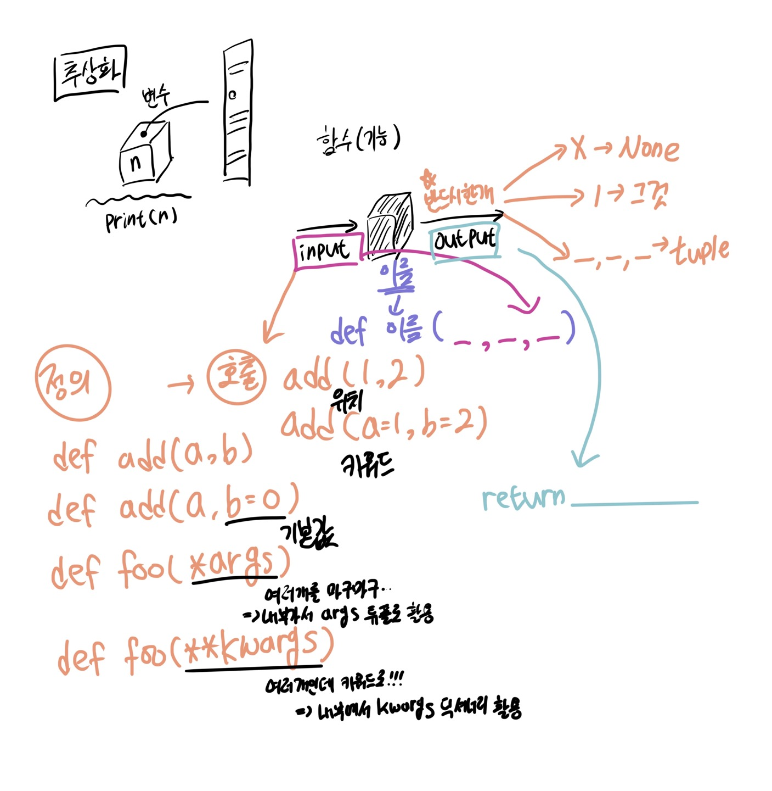

## 0713 (오전)

### 🎯 오전 학습 목표 : Python 기초_youtube_live

#### 함수(function) : 어떠한 ''기능''을 쓸 수 있게 만드는 것

함수는 호출되면 코드를 실행하고 return 값을 반환하며 종료된다.


##### ✔️ 변수와 타입

> 타입 : int, float, complex, bool, str, list, tuple, range, set, dictionary

```python
# len('happy!')
word = 'happy!'
cnt = 0
for char in word:
  cnt += 1
  
# sum([1, 10, 100])
numbers = ([1, 10, 100])
result = 0
for number in numbers:
  result += number
```


✍🏻 함수를 사용하는 이유? 

1. Decomposition(기능을 분해, 재사용)
2. Abstraction(추상화) : 복잡한 내용을 숨기고, 기능에 집중하여 사용할 수 있음. **재사용성, 가독성, 생산성**


##### ✔️ 함수 기본 구조

-  <u>**선언과 호출(define & call)**</u>

  - 함수의 선언 키워드는 `def`

  - 들여쓰기를 통해 Function body(실행될 코드 블록)를 작성함

    - 작성 시 반드시 첫 번째 문장에 문자열 ''' '''

  - 함수는 parameter를 넘겨줄 수 있음

  - 함수는 동작 후에 return을 통해 결과값을 전달함 

    

- <u>**결과값(Output)**</u>

  - 함수는 반드시 값을 **<u>하나만</u>** return 한다.
    - **명시적인 return이 없는 경우에도 None을 반환한다.**
  - 함수는 return과 동시에 실행이 종료된다.

  

**📌 return vs print**

```python
- return은 함수 안에서 값을 반환하기 위해 사용되는 키워드
- print는 출력을 위해 사용되는 함수
```


- **<u>입력(Input)</u>**

**📌 argument vs parameter**

```python
- argument : 함수를 호출할 때 넣어주는 값
  
  function('spam')   # argument : 'spam'
  
- parameter : 함수를 실행할 때, 함수 내부에서 사용되는 식별자
  
  def function(ham): # parameter : ham
    return ham
```


**Argument**

- 함수 호출 시 함수의 parameter를 통해 전달되는 값

- Argument는 소괄호 안에 할당 func_name(argument) 

  - 필수 Argument : 반드시 전달되어야 하는 argument ⭐️

  - 선택 Argument : 값을 전달하지 않아도 되는 경우는 기본 값이 전달 ⭐️

  

**📌 positional arguments vs keyword arguments**

```python
- positional argument : 기본적으로 함수 호출 시 Argument는 위치에 따라 함수 내에 전달됨
  # positional : 위치(기본)
  
  def add(x, y): # add(2, 3)
    return x + y
  
- keyword arguments : 직접 변수 이름으로 특정 Argument를 전달할 수 있음
  # keyword argument 다음에 positional argument를 활용할 수 없음 🚨 
  # 아래 코드에서 add(x = 2, 5) 는 불가능함 ⭐️
  # x = 2라고 keyword argument 사용 후에는 뒤에 오는 positional argument는 의미가 없어짐
  
  def add(x, y): # add(x = 2, y = 5)
    return x + y # add(2, y = 5)
```


- 정해지지 않은 갯수의 arguments

  - 여러 개의 positional argument를 하나의 필수 parameter로 받아서 사용
  - 몇 개의 positional argument를 받을지 모르는 함수를 정의할 때 유용

  ```python
  def add(*args): # add(2)
    for arg in args: # add(2, 3, 4, 5)
      pring(arg)
      
  # 예시
  # 정해지지 않은 갯수의 인자
  def my_add(*numbers):
    # 내부적으로 numbers가 tuple
    return numbers
  
  result = my_add(1, 2, 3)
  print(result, type(result)) # (1, 2, 3) <class 'tuple'>
  ```

  

- 정해지지 않은 개수의 keyword arguments

  - 함수가 임의의 갯수 Argument를 keyword argument로 호출될 수 있도록 지정
  - argument들은 딕셔너리로 묶어 처리되며, parameter에 **를 붙여 표현

  ```python
  def family(**kwargs):
    for key, value in kwargs:
      print(key, ":", value)
  # family(father='John', mother='Jane', me='John Jr.')
  
  # 예시
  def my_func(**kwargs):
    return kwargs
  
  result = my_func(name = '홍길동', age = '100', gender = 'M') 
  # key-value 를 쌍으로 넘겨줌, Dictionary
  # {'name' = '홍길동', 'age' = '100', 'gender' = 'M'}
  print(result, type(result))
  ```

  

- <u>**범위(Scope)**</u>

  - 함수는 코드 내부에 local scope를 생성하며, 그 외의 공간인 global scope로 구분

  **📌 scope vs variable**

  ```python
  - scope 
  	> global scope : 코드 어디에서든 참조할 수 있는 공간
    > local scope : 함수가 만든 scope. 함수 내부에서만 참조 가능
    
  - variable
  	> global variable : global scope에 정의된 변수
    > local variable : local scope에 정의된 변수
      
  # 예시
  def foo():
      a = 1
  
  foo()
  print(a)
  # NameError: name 'a' is not defined
  # 정의된 foo 라는 함수 안에 자체적으로 독립적인 범위(scope)가 존재한다.
  # foo 라는 함수 안에 a = 1 있다. 이 부분이 local scope
  # def foo 안에서는 a = 1 을 사용 할 수 있지만, def foo 밖(global scope)에서는 a 값을 꺼내 사용할 수 없다. 
  
  
  # global scope, local scope 에 대한 이해 확실히 해두기 ! 
  ```

  

  - 객체 수명주기(lifecycle) ⭐️

    - built-in scope : 파이썬이 실행된 이후부터 영원히 유지

    > print, sum, len ... 파이썬이 미리 만들어 둔 함수

    - global scope : 모듈이 호출된 시점 이후 혹은 인터프리터가 끝날 때까지 유지

    > a = 3

    - local scope : 함수가 호출될 때 생성되고, 함수가 종료될 때까지 유지

    > def <def_name>:

    ```python
    # 예시
    def func():
      a = 20
      print('local', a)
      
    func()
    print('global', a)
    
    # local 20
    ---------------------
    # 3 print('local', a)
    # 5 func() ---->
    # 6 print('global', a)
    # NameError : name 'a' is not defined
    
    # 결론 : a는 Local scope에서만 존재 !!!. def func 함수 종료(return) 후 수명주기가 종료 됨
    ```

    

  - 이름 검색 규칙(Name Resolution) 

    - 파이썬에서 사용되는 이름(식별자)들은 이름공간(name space)에 저장되어 있음

    - LEGB Rule L `ｃ` E `ｃ` G `ｃ` B

      - Local scope : 함수
      - Enclosed scope : 특정 함수의 상위 함수
      - Global scope : 함수 밖의 변수, Import 모듈
      - Built-in scope : 파이썬 안에 내장되어 있는 함수 또는 속성

    - 즉, 함수 내에서는 바깥 Scope의 변수에 접근 가능하나 수정은 할 수 없음 ⭐️

      ```python
      # 예시
      # LEGB
      sum = 5
      
      print(sum([1, 2, 3]))
      
      # Traceback (most recent call last):
      #  File "/Users/jodeoggyu/Desktop/TIL/class_solving/0713/function_5.py", line 4, in <module>
      #    print(sum([1, 2, 3]))
      # TypeError: 'int' object is not callable
      
      # sum이 지금은 5가 되어버림 T.T
      # Built-in scope에 sum 함수가 있었음.
      # Global scope에 sum 이름의 변수를 만들었음.
      # 제가 찾았으니까 L -> E -> G -> B
      ```

      

##### ✔️ 함수 응용

1. map(function, iterable)

   - **<u>순회 가능한</u>** 데이터구조(iterable)의 모든 요소에 함수(function) 적용하고, 그 결과를 map object로 변환

   ```python
   # 도입
   numbers = [1, 2, 3]
   result = map(str, numbers)
   print(result, type(result))
   # <map object at 0x10e2ca100><class 'map'>
   
   list(result)
   # ['1', '2', '3']
   # 리스트 형변환을 통해 결과 직접 확인
   
   
   # map 예시 1
   numbers = ['1', '2', '3']
   
   # 숫자로 바꿔서 쓰고 싶다?
   # 리스트를 숫자로 형 변환은 불가능
   # 다만, 숫자 형태의 문자를 변환할 수는 있다.
   # n = int(numbers)
   
   # 이렇게 가능함, 근데 100개, 1000개 인 경우엔?
   a = int(numbers[0])
   b = int(numbers[1])
   c = int(numbers[2])
   new_numbers = [a, b, c]
   
   # 반복문
   print(numbers)
   new_numbers = []
   for number in numbers:
       new_numbers.append(int(number))
   print(new_numbers)
   
   # map !
   numbers = ['1', '2', '3']
   new_numbers_2 = map(int, numbers)
   print(new_numbers_2, type(new_numbers_2)) 
   # <map object at 0x104369be0> : 이미 함수가 모두 적
   # <class 'map'>
   print(list(new_numbers_2)) 
   # 리스트로 형변환해서 보면 바뀌어있다.
   # 확인하기 위해 리스트로 바꾼 것임, 반드시 List로 바꿀 필요 없다.
   ```

   

   ```python
   # map 예시 2
   
   # 직사각형의 넓이를 구하시오
   # 세로는 n, 가로는 m
   # Input 예시 : n = 10, m = 20
   
   n, m = map(int, input().split())
   # input() : 타입 - 항상 string(문자열)
   # .split() : 문자열.split() 으로 내가 구분값을 기준으로 쪼개겠단 말. 반환 결과는 항상 리스트
   # 문자열로 받은 것은 각각의 공백을 기준으로 리스트로 쪼갬
   # 리스트로 본다면 ['10', '20']
   
   # 따라서 map이란, 
   # 어떤 함수를 반복가능한 것들의 요소에 모두 적용시킨 결과 !
   
   # int 함수를 input().split() 리스트의 모든 요소에 적용한 결과
   
   # => map object
   # [10, 20]
   
   # 따라서 n, m = [10, 20]
   
   print(n*m)
   
   # 내장함수를 10을 다 더해주는 함수가 존재함
   def plus10(n):
       return n + 10
   
   numbers = [10, 20, 30]
   new_numbers = list(map(plus10, numbers))
   print(new_numbers)
   ```

   

   - 알고리즘 문제 풀이 시 input 값들을 숫자로 바로 활용하고 싶을 때 유용하게 사용

   ```python
   n, m = map(int, input().split()) # 3 5
   
   print(n, m)
   print(type(n), type(m)) # 3 5
   # <class 'int'> <class 'int'>
   ```

   

##### 📌 학습 참고 사이트

```bash
1. 파이썬 자습서[site] : https://docs.python.org/ko/3/tutorial/index.html
2. 파이썬 표준 라이브러리[site] : https://docs.python.org/ko/3/library/index.html
3. 파이썬 공식 Documents(english.ver)[site] : https://docs.python.org/3/
```


##### 📌 참고 내용

```python
# sep에 대한 이해

print('hello', 'hi') # helllo hi
print('hello', 'hi', sep='-') # hello-hi
# 기본값이 sep는 ' ' 으로 정의가 되어 있음.
# 키워드로 sep을 바꿔서 호출할 수 있음
print(1, 2, 3, 4, 5, 6, 7, 8)
```


##### 📌 오전 수업 한 장 그림 요약



