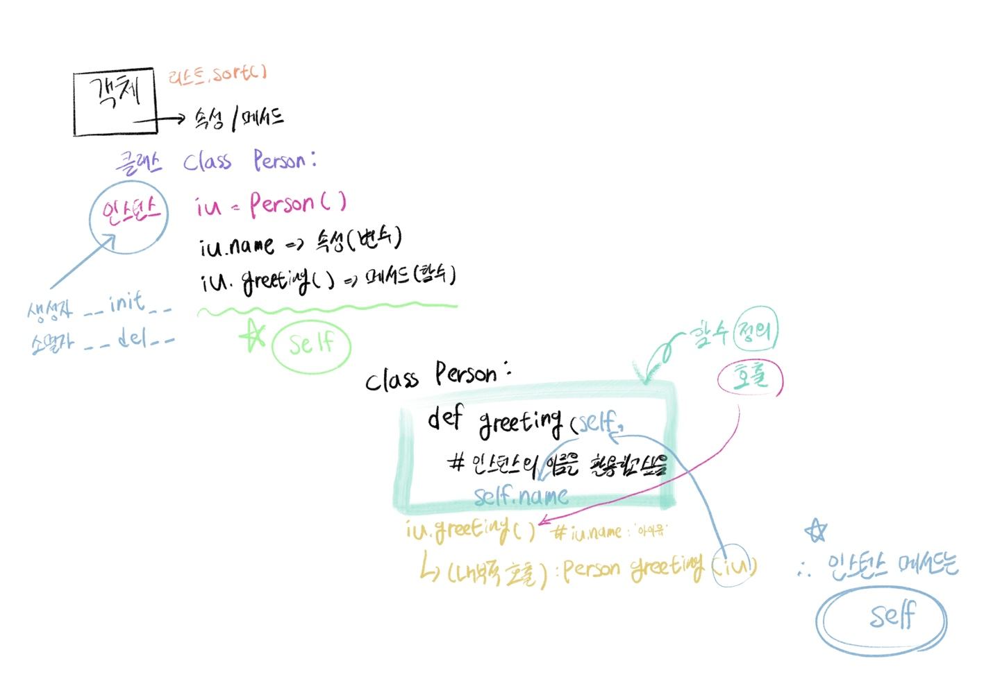

## 0719 (오전)

### 🎯 오전 학습 목표 : OOP 기초 및 활용


#### OOP(Objet-Oriented Programming, 객체 지향 프로그래밍)

```python
객체(object)는 특정 타입(class)의 인스턴스(사례, 예시)이다.

# 예시
- 123, 900, 5는 모두 Int의 인스턴스
- 'hello', 'bye'는 모두 str의 인스턴스
- [232, 89, 1], []는 모두 list의 인스턴스
```

```python
객체       예시1      예시2
클래스     person     List
인스턴스     IU     [1, 2, 3]
```


- 객체 : 객체 또는 오브젝트(object)는 클래스에서 정의한 것을 토대로 메모리(실제 저장공간)에 할당된 것

- 객체의 특징

  - 타입(type) : 어떤 연산자(operator)와 조작(method)이 가능한가?

  - 속성(attribute) : 어떤 상태(데이터)를 가지는가?

  - 조작법(method) : 어떤 행위(함수)를 할 수 있는가?

    > 메서드는 클래스 내부 정의 함수를 의미함

- 객체 지향 프로그래밍

  - 프로그램을 여러 개의 독립된 객체들과 그 객체들 간의 상호작용으로 파악하는 프로그래밍 방법
  - 컴퓨터 프로그래밍의 패러다임 중 하나
  - 컴퓨터 프로그램을 명령어의 목록으로 보는 시각에서 벗어나 여러 개의 독립된 단위, 즉 객체들의 모임으로 파악
  - 파이썬은 모두 객체로 이루어져 있음

- 장점

  - 프로그램을 유연하고 변경이 용이하게 만들기 때문에 대규모 소프트웨어 개발에 활용
  - 소프트웨어 개발과 보수를 간편하게, 보다 직관적인 코드 분석 가능

```python
# 예시 : 객체지향 프로그래밍
class Rectangle:
  def __init__(self, x, y):
    self.x = x
    self.y = y
    
  def area(self):
    return self.x * self.y
  # 메서드 : 클래스 내부 정의 함수
  
  def circumference(self):
    return 2 * (self.x + self.y)
  
r1 = Rectangle(10, 30)
r1.area()
r1.circumference()

r2 = Rectangle(300, 20)
r2.area()
r2.circumference()
```


#### OOP 기초

##### oop 기본 문법

```python
# 클래스 정의
class MyClass:
  pass
#	인스턴스 생성
my_instance = MyClass()
# 메서드 호출
my_instance.my_method()
# 속성
my_instance.my_attribute
```

```python
CamelCase : 클래스
snake_case : 변수 / 함수
```


- 클래스와 인스턴스
  - 클래스 : 객체들의 분류(class)
  - 인스턴스 : 하나하나 실체/예(instance)
  - 파이썬은 모든 것이 객체, 모든 객체는 특정 타입의 인스턴스

```python
class Person:
  pass

print(type(Person))
# type
# 모든 클래스의 타입은 type
p1 = Person()
type(p1)
# __main__.Person
# 모든 인스턴스는 개별적인 class 호명됨
isinstance(person1, Person)
# True
```


- 객체 비교하기
  - ==
    - 동등한(equal)
    - 변수가 참조하는 객체가 동등한(내용이 같은) 경우 True
    - 두 객체가 같아 보이지만 실제로 동일한 대상을 가리키고 있다고 확인해 준 것은 아님
  - is
    - 동일한(identical)
    - 두 변수가 동일한 객체를 가리키는 경우 True

```python
a = [1, 2, 3]
b = [1, 2, 3]

print(a == b, a is b)
# true false
# 값은 같음. 그러나 주소는 다름

a = [1, 2, 3]
b = a

print(a == b, a is b)
# true true
# 값도 같고 주소도 같음
```


- 인스턴스 메소드 

  - 인스턴스 변수를 사용하거나, 인스턴스 변수에 값을 설정하는 메소드

  - 클래스 내부에 정의되는 메소드의 기본

    - 호출 시, 첫 번째 인자로 인스턴스 자기자신(self)이 전달 됨

    ```python
    class MyClass
    	def instance_method(self, arg1, ...)
      
    my_instance = MyClass()
    my_instance.instance_method(...)
    ```

  - self
    - 인스턴스 자기자신
    - 파이썬에서 인스턴스 메소드는 호출 시 첫번째 인자로 인스턴스 자신이 전달되게 설계
      - 매게변수 이름으로 self를 첫번째 인자로 정의
      - 다른 단어로 써도 작동하지만, 파이썬의 암묵적인 규칙

  

- 생성자(constructor) 메소드

  - 인스턴트 객체가 생성될 때 자동으로 호출되는 메소드

  - 인스턴스 변수들의 초기값을 설정

    - 인스턴스 생성
    - `__init__` 메소드 자동 호출

    ```python
    class Person:
      
      def __init__(self):
        print('인스턴스가 생성되었습니다.')
        
    person1 = Person()
    # 인스턴스가 생성되었습니다.
    
    class Person:
      
      def __init__(self, name):
        print(f'인스턴스가 생성되었습니다. {name}')
        
    person1 = Person('지민')
    # 인스턴스가 생성되었습니다. 지민
    ```

    

##### 📌 오전 수업 한 장 그림 요약



##### 📌 문제 풀이 사이트 비교

```python
# input 차이가 존재함
SW Expert Academy(SWEA)
- print로 출력하는게 기본
- 입력을 받아서 형변환해서 써야함
- 작성자가 직접 리스ㅌ에 담아야 함
- 결과가 리스트여도 반복해서 출력하는 형식이어야함

Programmers 
- input 시 데이터 타입을 넘겨줌

플랫폼 별 Input 형식이 다르므로, 다양하게 풀어보고 적응할 필요성이 있음
```

```python
# 문제 풀이 시 vs code를 그 폴더에서 열어서 활용

# 실제 로컬에서 코드 작성 시 텍스트파일을 받아서 아래 두 줄 입력!
# 제출하기 전에는 아래 두 줄은 주석 처리 필요

import sys
sys.stdin = open("textfile_name.txt", "r")
```

