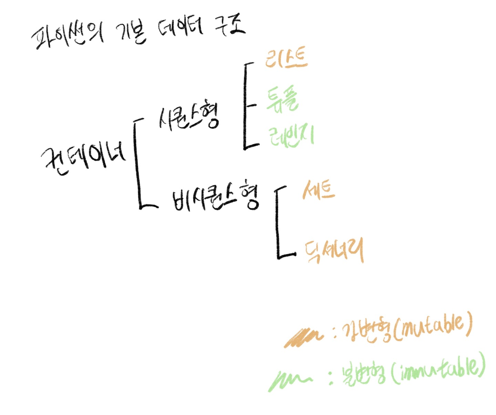

## 0725 (오전)

### 🎯 오전 학습 목표 : 알고리즘 INTRO

#### 1. 알고리즘? 코딩테스트?

- Algorithm?

  - 어떤 문제를 해결하기 위해 정해진 일련의 절차나 행동
  - 문제란 Input을 넣으면 원하는 Output을 도출

- Coding Test?

  - 기업에서 지원자를 대상으로 코딩을 통한 알고맂므 기반 문제 해결 능력을 테스트 하는 것
  - 문제 의도를 정확히 파악하고, 적절한 해결 방법을 적용할 수 있는가?
  - 해결 방법을 프로그래밍을 통해 능숙하게 구현할 수 있는가?

  

#### 2. 코딩테스트 종류

- 코딩테스트 Tip
  - 사전에 연습장과 필기도구 준비
  - 테스트 케이스 이외의 **엣지 케이스**도 확인
  - 냅다 코드 작성부터 하지 말고, 시간 배분과 문제 파악부터 하기
  - 인터넷, IDE, 알고리즘 노트 적극 활용
- 오프라인 유형1 : 개발형 코딩테스트(Rest API, json)
- 오프라인 유형2 : 화이트보드 손코딩
  - 논리, 과정, 커뮤니케이션 스킬 평가


#### 3. 코딩테스트 준비하기

- 많이 풀기

| 문제 풀이 사이트           | 특징                                                         |
| -------------------------- | ------------------------------------------------------------ |
| 백준 온라인 저지 (BOJ)     | 가장 많이 사용하는 플랫폼<br />최다 문제 보유<br />유형별, 단계별 문제 제공 |
| 프로그래머스 (Programmers) | 실제 코딩테스트 환경과 유사<br />카카오 기출 문제 제공       |
| 코드업 (Code up)           | 기초 파이썬 100제                                            |
| SW Expert Academy (SWEA)   | 삼성전자에서 제작한 플랫폼<br />삼성 SW 역량 테스트 문제 다수 보유 |

- 알고리즘 문제 300-350문제 정도 풀면 대부분 코테는 (무난히) 합격 가능
  - 기초 100개, 중급 100개, 고급 100개
- 기타 tip
  - 변수명 대충 짓지 않기
  - 언어가 가지는 내장 함수, 라이브러리 적극 활용
  - 반복되는 코드는 함수화를 통해 가독성 있게 작성
  - <u>면접을 위해 풀이를 남에게 설명하는 연습 반드시 필요</u>


#### 4. 데이터 구조와 알고리즘

- 프로그램 = 데이터 구조 + 알고리즘 (Niklaus Writh)
- Data Structure?
  - 데이터를 다양한 방식으로 저장 + 조회, 삽입, 변경, 삭제와 같은 조작 기능 제공
- Importance of Data Structure
  - 데이터를 필요에 따라 저장, 활용하면서 <u>문제를 더 효율적으로 풀기 위함</u>

- iterable : 순회 가능한
  - 순회 가능하기 때문에 슬라이싱 할 수 있고 인덱싱 할 수 있다.
- **데이터 구조**
  - 리스트, 문자열, 딕셔너리, 스택, 큐, 그래프
- **알고리즘**
  - 재귀, 완전탐색, 시뮬레이션, 깊이우선탐색(DFS), 너비우선탐색(BFS), 백트래킹


#### 5. 입력 & 출력

1. 입력 활용 에시(input)

   - 사용자의 **입력 한 줄**을 **문자열**로 받는 함수

   ```python
   # 문자열 입력 받기
   a = input()
   
   # 한 개 숫자 입력 받기
   b = int(input())
   c = float(input())
   
   # 여러 개 숫자 입력 받기
   d, e = map(int, input().split())
   f, g, h = map(float, input().split())
   ```

   ```python
   # 파이선 내장함수 map
   # map(funciton, iterable)
   map(int, ["1", "2", "3"]) 
   # 정수 1, 2, 3 반환
   map(float, ["1", "2", "3"])
   # 부동소수점 1.0, 2.0, 3.0 반환
   map(int, "123")
   # 리스트 뿐만 아니라 문자열에도 적용 가능
   # 정수 1, 2, 3을 반환
   ```

2. 출력 활용 예시(print)

   - 데이터를 **출력**할 수 있는 함수이며, 자동적으로 **줄 바꿈** 발생

   ```python
   # 콤마(,)를 이용해 여러 인자를 넣으면 공백 기준으로 출력
   a = 'happy'
   b = 'hacking'
   
   print(a, b)
   # happy hacking
   ```

   ```python
   # end, sep 옵션을 사용하여 출력 조작하기
   a = 'happy'
   b = 'hacking'
   
   print(a, end = "@")
   print(b)
   # happy@hacking
   
   print(a, b, sep = "\n")
   # happy
   # hacking
   ```

   ```python
   # 예시
   a, b, c = map(int, input().split())
   # 1 2 3
   
   print(a, b, c, end = "&")
   # 1 2 3&
   ```


#### 📌 CS 학습 사이트

```python
https://www.edx.org/course/introduction-to-computer-science-and-programming-7
  
https://cs61a.org/
```


#### 📌 한 장 그림 요약




## 0725(오후)

### 🎯 오후 학습 목표 : 실습 변동사항 확인 및 적용


#### 

