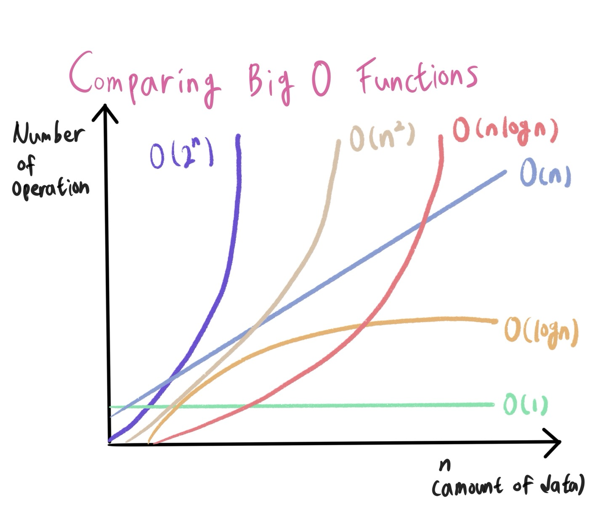

## 0726 (오전)

### 🎯 오전 학습 목표 : 알고리즘 2

취업 위의 커리어, 커리어 위의 나의 삶. 메모 ⭐️


#### 1. 알고리즘의 시간 복잡도

- 좋은 알고리즘 ? == 효율성이 좋은? == 성능이 좋은? == Input 후 Output 도출 시간이 짧은 !
- 객관적인 측정을 위해 **알고리즘 내부에서** 기본연산이 몇 번 일어나는지 확인
  - 기본 연산 : 단위 시간 1이 소요되는 연산
    - 할당, 산술, 비교, 반환...
  - 기본 연산의 총 횟수 == 알고리즘의 소요 시간
- 성능 측정 시 입력을 통일시킴
  - 기본연산이 가장 많이 일어나는 **최악의 입력 n개**가 들어온다고 가정

- 시간 복잡도 (Time Complexity)
  - 계산 복잡도 이론에서 시간 복잡도는 문제를 해결하는 데 걸리는 시간과 입력의 함수 관계
  - 단순하게 <u>알고리즘의 수행 시간</u>
    - 시간 복잡도가 높다 -> 느린 알고리즘
    - 시간 복잡도가 낮다 -> 빠른 알고리즘


#### 2. Big-O 표기법

- 입력 n이 **무한대**로 커진다고 가정하고 시간 복잡도를 간단하게 표시

  - 최고차항만 남기고 계수와 상수 제거

  - 매 입력에 따라 정확한 수식을 구하는 것이 불가능
  - 정확한 수치보다 **증가율**에 초점

- 다양한 시간 복잡도



```python
O(1) : 단순 산술 계산(덧셈, 뺄셈, 곱셈, 나눗셈)
  # a + b, 100 * 200
  
O(logN) : 크기 N인 리스트를 반절씩 순회/탐색
  # 이진탐색(Binary Search), 분할정복(Divide & Conquer)

O(N) : 크기 N인 리스트를 순회
  # 1중 for문, count()
  ## 1초가 걸리는 입력의 크기 : 1억(기준)
  
O(NlogN) : 크기 N인 리스트를 반절씩 탐색 * 순회
  # 높은 성능의 정렬(Merge/Quick/Heap Sort)
  ## 1초가 걸리는 입력의 크기 : 500만
  
O(N^2) : 크기 M, N인 2중 리스트를 순회
  # 2중 for문
  ## 1초가 걸리는 입력의 크기 : 1만
  
O(N^3) : 3중 리스트를 순회
  # 3중 for문
  ## 1초가 걸리는 입력의 크기 : 500
  
O(2^N) : 크기 N인 집합의 부분 집합
  ## 1초가 걸리는 입력의 크기 : 20
  
O(N!) : 크기 N인 리스트의 순열
  ## 1초가 걸리는 입력의 크기 : 10
```

```python
# 방법 1: 1부터 n까지 일일이 더하기
def get_total(n):
  total = 0
  
  for i in range(1, n + 1):
    total += i
    
  return total

print(get_total(10))
# 55

print(get_total(100000000)
# 제한 시간 1초 초과
      
# 방법 2 : 가우스의 합 공식
def get_total(n):
      return (n * (n + 1)) // 2
      
print(get_total(10))
# 55

print(get_total(100000000)
# 50000000500000000
```

- 같은 Output을 만드는 알고리즘이라도 시간 복잡도에 따라 **성능**이 달라지고 시험에서 **정답** 여부가 갈린다.

```bash
✍🏻 for문을 1번만 사용했다고 해서 무조건 O(n)인 것이 아님 !!!

		for문 안에 O(n)의 내장 함수를 사용했다면 사실상 이중 for문과 다를 것이 없다.
```


#### 3. 리스트

1. 배열 vs 연결리스트

   1. 배열 (Array)

   - 여러 데이터들이 연속된 메모리 공간에 저장되어 있는 자료구조

     - 인덱스(Index)를 통해 데이터에 빠르게 접근
     - 배열의 길이는 변경 불가능 -> 길이를 변경하고 싶다면 새로 생성
     - 데이터 타입은 고정
     - '중간에' 새로운 데이터를 넣기에 어려움

     ```c
     # c언어에서의 배열 선언
     int arr[5] = {70, 80, 20, 100, 90};
     ```

   

   2. 연결 리스트 (Linked List)

   - 데이터가 담긴 여러 노드들이 순차적으로 연결된 형태의 자료구조
     - 맨 처음 노드부터 순차적으로 탐색
     - 연결리스트의 길이 자유롭게 변경 가능 -> 삽입, 삭제가 편리
     - 다양한 데이터 타입 저장
     - 데이터가 메모리에 연속적으로 저장되지 않음


2. 파이썬 리스트의 메서드

   1. `.append()`

      리스트 맨 끝에 새로운 원소 **삽입**

      ```python
      a = [1, 2, 3, 4, 5]
      a.append(["a", "b"])
      print(a) # [1, 2, 3, 4, 5, ["a", "b"]]
      ```

   2. `.pop()`

      특정 인덱스에 있는 원소를 **삭제 및 반환**

      ```python
      a = [1, 2, 3, 4, 5]
      b = a.pop(2)
      
      print(a) # [1, 2, 4, 5]
      print(b) # 3
      ```

   3. `.count()`

      리스트에 해당 원소의 **개수**를 반환

      ```python
      a = [1, 2, 2, 3, 3, 3]
      print(a.count(3)) # 3
      ```

   4. `.index()`

      리스트에서 처음으로 원소가 등장하는 **인덱스** 반환

      ```python
      a = [1, 2, 3, 2, 5]
      print(a.index(2)) # 1
      ```

   5. `.sort()`

      리스트를 오름차순으로 **정렬**

      `reverse = True` 옵션을 통해 내림차순으로 정렬 가능

      ```python
      a = [5, 2, 4, 0, -1]
      a.sort()
      print(a) # [-1, 0, 2, 4, 5]
      ```

   6. `.reverse()`

      리스트의 원소들의 순서를 거꾸로 **뒤집기**

      ```python
      a = [1, 2, 3, 4, 5]
      a.reverse()
      print(a) # [5, 4, 3, 2, 1]
      ```

   7. 그 밖에 자주 쓰이는 내장함수

      - `len(iterable)` : 리스트의 **길이**(원소의 개수) 반환 
      - `sum(iterable)` : 리스트의 모든 원소의 **합** 반환
      - `max(iterable)` : 리스트의 원소 중 **최댓값** 반환
      - `min(iterable)` : 리스트의 원소 중 **최솟값** 반환
        - `sorted(iterable)` : 오름차순으로 **정렬**된 새로운 리스트 반환, **원본 리스트는 변화 없음**
      - `reversed(iterable)` : 리스트의 순서를 거꾸로 **뒤집은** 새로운 객체 반환, **원본 리스트는 변화 없음**
