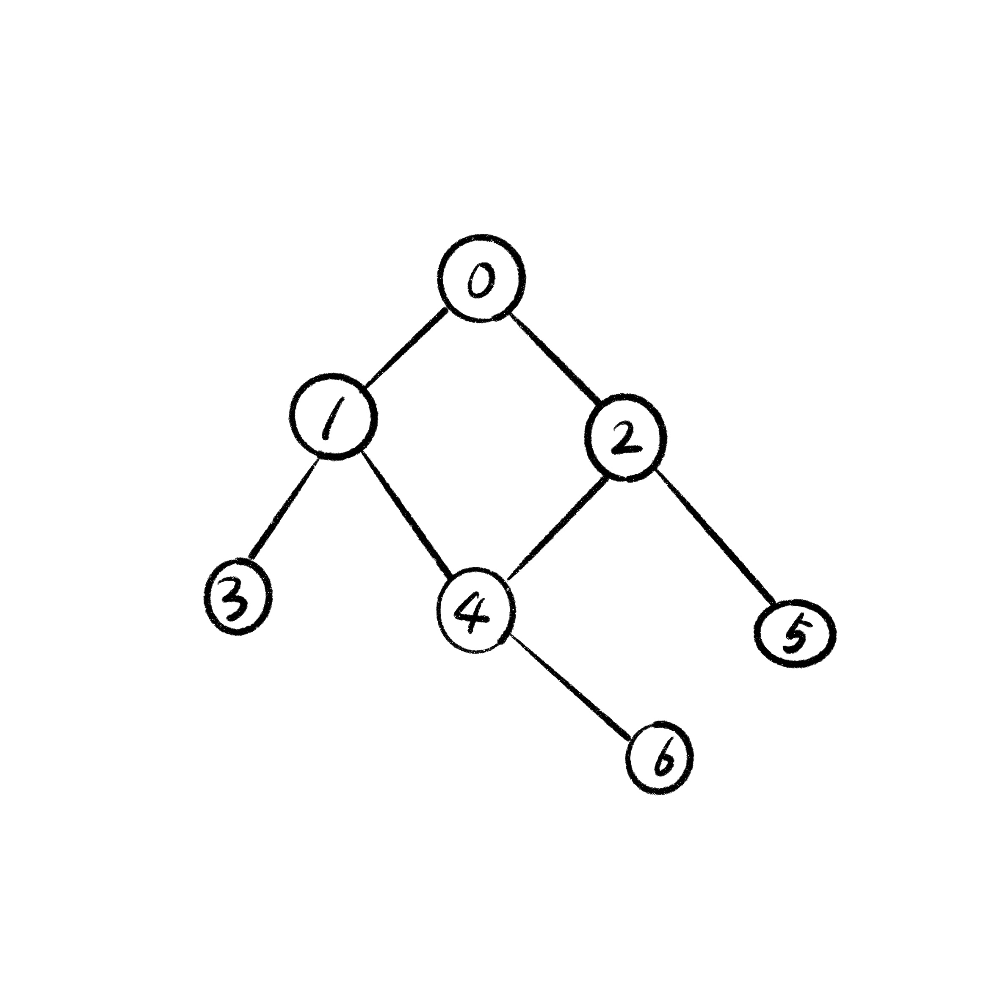

## 0809 KDT Class_note_down

### 🎯 학습 목표 : 알고리즘

#### 1. 그래프에 대한 이해

- 정점(Vertex)과 이를 연결하는 간선(Edge)들의 집합으로 이루어진 비선형 자료구조
- sns와 지하철 노선도 같이, 현실에 있는 개체 간의 관게를 나타내기 위해 사용됨

- 그래프 관련 용어
  - 정점(Vertex) : 간선으로 연결되는 객체이며, 노드(Node)라고도 함
  - 간선(Edge) : 정점 간의 관계(연결)를 표현하는 선
  - 경로(Path) : 시작 정점부터 도착 정점까지 거치는 정점을 나열한 것
  - 인접(Adjacency) : 두 개의 정점이 하나의 간선으로 직접 연결된 상태


#### 2. 그래프의 종류

1. 무방향 그래프(Undirected graph)

   - 간선의 방향이 없는 가장 일반적인 그래프
   - **차수(Degree)** : 하나의 정점에 연결된 간선의 개수
   - 모든 정점의 차수의 합 = 간선수 x 2

   

   ```python
   # 위 그래프를 코드로 짜면,
   
   graph = {
     0 : [1, 2],
     1 : [0, 3, 4],
     2 : [0, 4, 5],
     3 : [1],
     4 : [1, 2, 6],
     5 : [2],
     6 : [4]
   }
   
   # print(graph[0][0]) => 1
   
   graph = [
     [1, 2],
     [0, 3, 4],
     [0, 4, 5],
     [1],
     [1, 2, 6],
     [2],
     [4]
   ]
   
   # print(graph[0][0]) => 1
   ```

   

2. 유방향 그래프(Directed graph)
   - 간선의 방향이 있는 그래프
   - **차수(Degree)** : 진입 차수와 진출 차수로 나누어짐
     - 진입 차수(In-degree) : 외부 정점에서 한 정점으로 들어오는 간선의 수
     - 진출 차수(Out-degree) : 한 정점에서 외부 정점으로 나가는 간선의 수


#### 3. 그래프의 표현

1. 인접 행렬(Adjacent matrix)

   - 두 정점을 연결하는 **간선이 없으면 0, 있으면 1**을 가지는 행렬로 표현하는 방식

     ```python
     # 입력
     
     # 인접 행렬 만들기
     
     # 인접 행렬 결과
     ```

     ```python
     # 관련 문제 : BOJ 24479
     edges = [
       [0, 1],
       [0, 2],
       [1, 3],
       [1, 4],
       [2, 4],
       [2, 5],
       [4, 6]
     ]
     
     # => flatten
     flatten_edges = [0, 1, 0, 2, 1, 3, 1, 4, 2, 4, 2, 5, 4, 6]
     print(*edges)
     
     # n = 7
     
     # n x n 행렬 초기화
     # matrix = [[0] * n for _ in range(n)]
     ```

   

2. 인접 리스트(Adjacent list)

   - 리스트를 통해 각 정점에 대한 인접 정점들을 순차적으로 표현하는 방식

     ```python
     # 입력
     
     # 인접 리스트 만들기
     
     # 인접 리스트 결과
     
     # 인덱스 번호가 정점의 번호를 의미함 ⭐️
     ```

     ```python
     matrix[v2][v1] = 1
     
     adjacent_list = [
       [1, 2],
       [0],
       [0],
       [],
       [],
       [],
       []
     ]
     
     # 0 1
     
     adjacent_list[0].append(1)
     adjacent_list[1].append(0)
     
     # 0 2
     
     adjacent_list[0].append(2)
     adjacent_list[2].append(0)
     ```


3. 인접 행렬 vs 인접 리스트

   - **인접 행렬**은 직관적이고 만들기 편하지만, 불필요하게 공간이 낭비됨

   - **인접 리스트**는 연결된 정점만 저장하여 효율적이므로 자주 사용됨

     ```python
     # 인접 행렬
     
     # 인접 리스트
     ```

     
