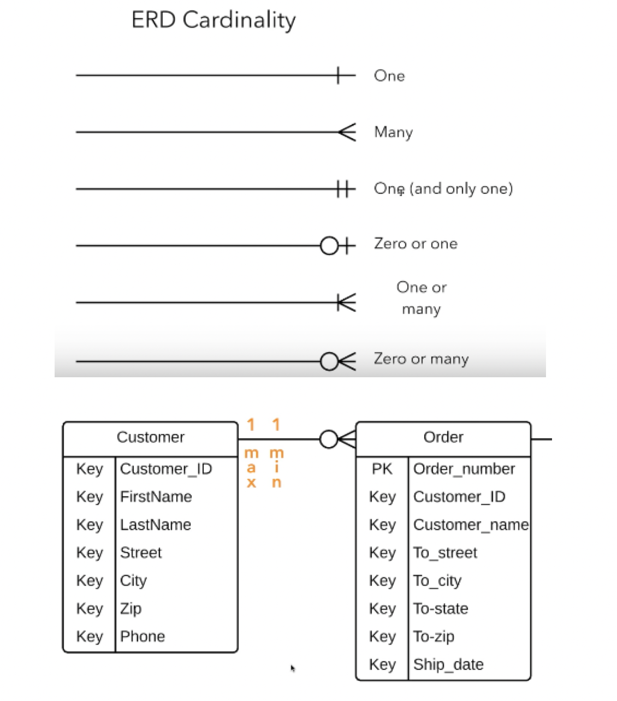

## 0823 KDT Class_note_down

### 🎯 학습 목표 : 데이터베이스 활용 

#### 1. 모델링

- 데이터베이스의 구조나 형식으로 모델 구조만 보고 어떤 데이터를 다루는지 알 수 있음
- 개념적 데이터 모델링
  - 데이터의 요구사항을 찾고 분석하는 과정, 핵심 개체(Entity) 사이의 관계를 찾아내고 표현
- 논리적 데이터 모델링
  - 데이터베이스 설계 프로세스의 과정으로 정보의 논리적인 구조와 규칙을 명확하게 표현하는 기법/과정
- 물리적 데이터 모델링
  - 논리적 데이터 모델이 데이터 저장소로서 어떻게 실제로 저장될 것인가

✏️ **ERD(Entity Relation Diagram) - 개체 관계 모델**

- 관계
  - 카디널리티(Cardinality) : 수적 관계
    - 1:1 관계 : A는 B를 하나 가진다. B는 A를 하나 가진다.
    - 1:N 관계 : A는 B를 여러 개 가진다. B는 A의 하나에 해당한다.
    - M:N 관계 : A는 B를 여러 개 가진다. B는 A를 여러 개 가진다.
  - 옵셔널리티
    - (1) 필수
    - (0) 선택

- UI/UX는 Database와 가장 밀접한 관계를 가짐
