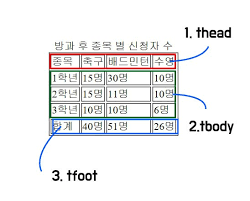

## 0905 KDT Class_note_down

### 🎯 학습 목표 : WEB

#### 1. HTML 문서 구조화



- table의 각 영역을 명시하기 위해 `<thead>` `<tbody>` `<tfoot>` 요소를 활용
- `<tr>` 으로 가로 줄을 구성하고 내부에는 `<th>` 혹은 `<td>` 로 셀을 구성
- colspan, rowspan 속성을 활용하여 셀 병합
- table 태그 기본 구성 -- 여기부터 재필기
  - thead
    - tr > th
  - tbody
    - tr > td
  - tfoot
    - tr > td
  - caption
- form
  - `<form>` 은 정보(데이터)를 서버에 제출하기 위해 사용하는 태그
  - `<form>` 기본 속성
    - action
    - method
    - enctype
- input
  - 다양한 타입을 가지는 입력 데이터 유형과 위젯이 제공됨
  - `<input>` 대표적인 속성
    - ㅇ
    - ㅇ
    - ㅇ

- input label
- input 유형 - 일반
  - ㅇ
  - ㅇ
- input 유형 - 항목 중 선택
  - 일반적으로 label 태그와 함께 사용하여 선택 항목을 작성
  - 동일 항목에 대하여는 name을 지정하고 선택된 항목에 대한 value를 지정해야함
    - checkbox : 다중 선택
    - radio : 단일 선택

- 즉, input이란?

  ```bash
  사용자가 입력 or 선택(개발자가 입력)
  
  ⭐️ value(값) name(이름)으로 매핑되어 서버에 전송
  ```

- input 유형 - 기타
  - 다양한 종류의,,


#### 2. BootStrap

- CDN : Content Delivery(Distribution) Network

  - 컨텐츠(CSS, JS, Image, Text 등)을 효율적으로 전달하기 위해 여러 노드에 가진 네트워크에 데이터를 제공하는 시스템
  - 개별 end-user의 가까운 서버를 통해 빠르게 전달 가능(지리적 이점), 외부 서버를 활용함으로써 본인 서버의 부하가 적어짐

- spacing (Margin and padding)

  ```html
  {property}{sides}-{size}
     ㅇㅇㅇㅇ
  ```

  표 생성하기 // spacing 종합만 표로 정리하기~!


#### 3. Color

```css
:root {
  --primary: #007bff;
  --secondary: #6c757d;
  --success
}
```

