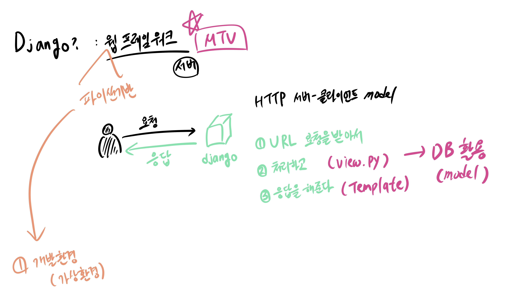

## 1004 KDT Class_note_down

### 🎯 학습 목표 : Django ModelForm I

#### 0. 지난 내용 복습



- Django : 웹 프레임워크로 서버의 역할
- 서버 : URL + method로 HTTP 요청 받아서 처리하며 HTTP 응답 하는 역할
- 프레임워크 구조  : MTV
- Form : 사용자로부터 값을 받아서`(input : name, value)` 서버로 전송 `(form : action, method)` 


#### 1. Django CRUD 복습


#### ✏️ 오늘 내용 요약 정리

```bash
- 서버에 자료와 데이터를 전송하는 Form은 일반적으로 POST 요청으로 처리한다.

- Django에서는 CSRF를 방지하기 위한 Token 설정을 강제하고 있다. (for 보안상 이점)
```

